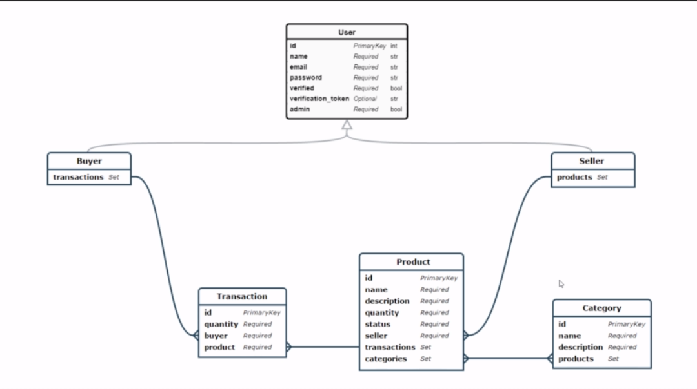

# laravel-rest-api-x2 - Documentation

## Diagram Class

## Endpoints

| Method   | URI                                           | Action                                 |
|----------|-----------------------------------------------|----------------------------------------|
| GET      | /products                                     | ProductController@index                |
| GET      | /products/{product}                           | ProductController@show                 |
| GET      | /products/{product}/buyers                    | ProductBuyersController@index           |
| GET      | products/{product}/buyers/{buyer}/transactions | ProductBuyerTransactionsController@index           |
| POST     | products/{product}/buyers/{buyer}/transactions | ProductBuyerTransactionsController@store           |
| GET      | /transactions                                 | TransactionController@index            |
| GET      | /transactions/{transaction}                   | TransactionController@show             |
| GET      | /transactions/{transaction}/categories        | TransactionCategoriesController@index    |
| GET      | /transactions/{transaction}/seller           | TransactionSellerController@index      |
| GET      | /users                                        | UserController@index                   |
| GET   | /users/{user}                                 | UserController@show                 |
| POST     | /users                                        | UserController@store                   |
| DELETE   | /users/{user}                                 | UserController@destroy                 |
| PUT   | /users/{user}                                 | UserController@restore                 |
